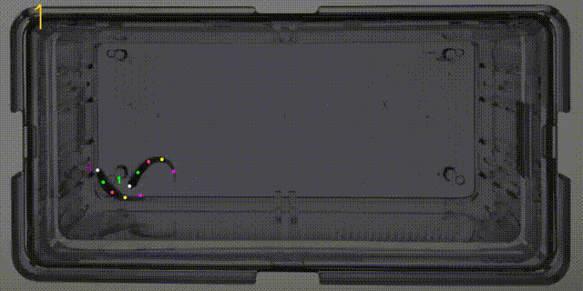

# ZCSBAR

## Introduction

This repository contains code for *Zebrafish Courtship-related Social Behavior Automated Recognition* (ZCSBAR).
We provide an offline data augmentation method that is suitable for cases with missing data annotations and improves recognition accuracy under multi-object overlapping occlusion.
We support network training with different annotation formats, utilizing the effective [yolov8-pose](https://docs.ultralytics.com/) detection model. For more information, please refer to the [arXiv preprint](https://arxiv.org/abs/2305.09972).



We provide an effective online tracking method for closed containers, supporting tracking results in MOT format (for tracking performance validation), as well as .npy or .json output formats (for future behavior recognition or temporal localization tasks).
Currently, we have open-sourced a demo that includes zebrafish tracking tests, where the Reid mode is specifically designed for identifying male and female zebrafish. Using Reid identification ensures tracking for up to 10 minutes, provided that the number of identified animals is 2. The online tracking method supports multiple animals. If you require longer identity tracking, please ensure optimal external factors such as lighting and water quality.
[This video Link](https://drive.google.com/drive/folders/16O9u-7Wt1zebxYDLn3XYZrAiKEgyarqo?usp=drive_link ) shows the movement of zebrafish during courtship behavior. 
High-speed cameras were used to record the tracking effect of the zebrafish courtship in an aquarium environment.

## Dependencies

The code is compatible with Python 3. The following dependencies are
needed to run ZCSBAR:

* NumPy==1.24.1
* OpenCV==4.10.0.84
* ultralytics==8.2.101
* lap
* filterpy>=1.4.0
* matplotlib==3.7.5
* yaml
* skimage


Additionally, feature generation requires Pytorch (>= 2.1).

## Datasets
[Zebrash_PoseEstimation](https://drive.google.com/drive/folders/16V7J_wqIJhkImOX8Ulxc2Y6vOnIFpPbe?usp=drive_link)   

[Zebrafish_Tracking](https://drive.google.com/drive/folders/1-1QXOLbj7I4XTXQOhL2htS5muhcvBWJz?usp=drive_link)

[Zebrash_Behavior](https://drive.google.com/drive/folders/1-1QXOLbj7I4XTXQOhL2htS5muhcvBWJz?usp=drive_link)
## Installation
Step 1.Clone the repository:
```
git clone https://github.com/11ts/ZCSBAR.git
```
Step 2.Create a new virtual environment.

```
conda create -n ZCSBAR python=3.8.19
```
Step 3.In the command line terminal, switch to this virtual environment. Enter the main directory of the current folder through the cd command.

```
pip install requirements.txt
```
Step 4.Then, download pre-generated pose and Reid checkpoint file from
[here](https://drive.google.com/drive/folders/16O9u-7Wt1zebxYDLn3XYZrAiKEgyarqo?usp=drive_link ).
Please place the downloaded weights in the `models` folder.
At the same time, we provide [benchmark videos here](https://drive.google.com/drive/folders/1t5wQ8Us4lW5Tw_Gs4CSe_w6-gvj4_SRV?usp=drive_link) for prediction. Its basic path needs to be configured in config.yaml.

*NOTE:* Our pre-trained zebrafish behavior recognition pose model, 
which is trained by the Zebrash tracking data set proposed in this paper. The Reid re-identification 
model is obtained by binary classification of the appearance characteristics of female and male fish.

## Tracking Demo Test

This is suitable for long-term tracking of courting animals, with the Reid mode enabled. Please place 
the downloaded model weights into the `models` folder and configure the tracking-related parameters in 
the config.yaml file, ensuring `Anormaly_detection['fixnum']=2` and `Anormaly_detection['status']=True`, 
and set `vediodir='input the path of the prediction video'`.
```
python run.py --command tracking_demo
```

## Data Augmentation
*NOTE:*  Currently, only the augmentation mode with two objects is available.

If you need to use this feature, please add an `aug` folder in the `dataset/[Dataset_root]` 
directory with the following structure:
```
aug/
  ├── BackGround/              # Store background images
  ├── input/                   # Store images in the format image1.png, image1.json
  ├── output_images/           # Store output images and YOLO format annotations
  ├── visual/                  # Visualize the augmentation effects
  └── trajectory.pkl           # Store the movement trajectory of male and female zebrafish
```
Configure the relevant parameters in the `config.yaml` file for `data_aug`, then run:
```
python run.py --command Dataaug
```
## Data Division
Place the annotated files into the `dataset/[Dataset_root]/origin` directory, with the format 
shown in `dataset/example/origin`, where the txt files are in YOLO format. Configure the relevant parameters in the `config.yaml` file 
for `data_division`,then run:
```
python run.py --command DataDivision
```
## Training
Configure the relevant parameters in the `config.yaml` file for `training`, then run:
```
python run.py --command training
```
## Tracking
Please place the trained pose weights in the `models` folder and set the weight path in the `config.yaml`. 
The trained pose recognition weights can be used for tracking multiple zebrafish targets, 
supporting only online tracking. The Reid function will be released in a future version. 
Configure the relevant parameters in the `config.yaml` file for tracking, then run:
```
python run.py --command tracking_operation
```
## Configuration config.yaml

```yaml
Project:
  Zebrash_tracking
data_aug:
  methodA: [intersection, 3]    # [method, num_sample]  
  methodB: [traject, 5]         # method including: intersection, norm / traject
                                # num_sample: generate num_sample*num_sample images by one image / numbers of trajectory per image
data_division:
  Dataset_root: Fish
  original: original
  format: 1                     # 1: yolo, 2: labelme, 3: x-anylabel, 4: coco
  test_frac: 0.2                # train/test frac
training:
  train: dataset/Fish/train 
  val: dataset/Fish/val
  kpt_shape: [5, 3]             # [joints number, [x, y, conf]]
  names:
    0: fish
  epochs: 70
  imgsz: 640
  batch: 16
  device: 0
  workers: 0
  model: yolov8m-pose            # yolov8n-pose, yolov8m-pose, yolov8l-pose
tracking:
  pose_model: models/best_hand.pt                                   # tracking_demo using anormalydect-reid-fpsort method
  tracking_method: FP-sort                                          # FP-sort, P-sort, FP-delta-sort  
  K_value: 20                                                       # if using FP-delta-sort, set value K from 0~150 for better tracking performance
  joints: 5                                                         # model input joint number
  reid_model: 
    status: True
    model_PATH: models/gender.pt
  Anormaly_detection: 
    status: True                                                   # Ensure only two target objects in the video
    fixnum: 2                                                     # object nums   
  vediodir: D:\user\Fish\video                                    # input predict video file path
  save_video: True
  save_json: True
  show: True
```
In package `ZCSBAR` is the main code:

* `coco2yolo.py`: Converts COCO annotation format to YOLO
* `custom.py`: Tracking effect visualization module
* `data_aug.py`: Data augmentation module
* `DataDivision.py`: Data division module
* `Extract_frame.py`:  Extracts frames from videos for data annotation
* `labelme2yolo.py`: Converts LabelMe annotation format to YOLO
* `track.py`: This is the multi-target tracker class.
* `Track_Demo.py`: This is the multi-target tracker class.
* `trackconfig.py`: This is the multi-target tracker config file.
* `train.py`: Module for training the pose model.


## Citing ZCSBAR

If you find this repo useful in your research, please contact us:

    EMAL1: zhangjingjing607@163.com
    Author: ZhanShu JingJingZhang
